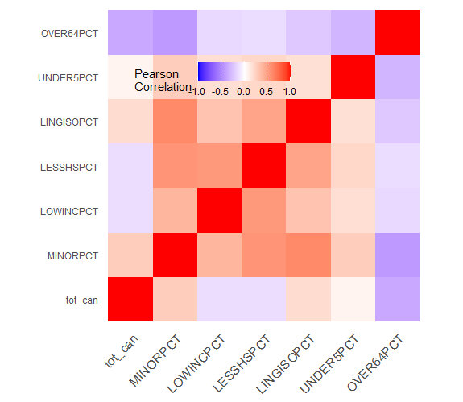
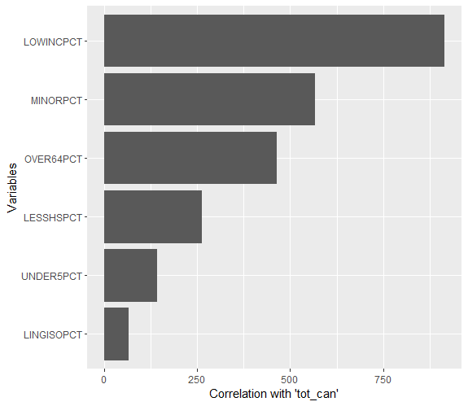

# Air-Toxin-Cancer-vs-Demographics-Analysis

## Introduction
___________________________________________
The increasing incidences of cancer cases across the globe raise significant concern, especially with the observed links between environmental factors and the disease. One of the environmental factors that have been associated with cancer risk is air toxins. Certain demographics may be more vulnerable to the effects of these toxins due to factors such as income, education, language barriers, and age distribution. Thus, this project aims to develop a visualization showcasing the cancer risk associated with air toxins based on these demographic vulnerability indicators. The importance of this study lies in its potential to provide critical insights that can guide policy decisions and inform strategies aimed at reducing cancer incidences in highly vulnerable communities.A detailed analysis on the dataset related to air toxics and cancer risk. 

## Objectives
___________________________________________
    The primary objectives of this analysis are:

1.  Understand the relationship between air toxins, cancer incidences, and various demographic factors.
2.  Identify the demographic groups that are most vulnerable to cancer due to air toxins.
3.  Forecast future trends of cancer incidences in relation to air toxins and demographic vulnerability.
4.  Optimize strategies for reducing cancer risks associated with air toxins in vulnerable communities.

## Dataset
___________________________________________
   The data used in this study is derived from the Environmental Justice (EJ) Screen dataset, which is publicly available at EPA's website. Key variables include total cancer cases (tot_can), percentage of minority population (MINORPCT), percentage of low-income population (LOWINCPCT), percentage of less than high school educated population (LESSHSPCT), percentage of linguistically isolated population (LINGISOPCT), percentage of under 5 years old population (UNDER5PCT), and percentage of over 64 years old population (OVER64PCT). These variables were chosen due to their relevance to the study's objectives of exploring the interplay of air toxins, cancer risk, and demographic vulnerability.
   
## Tools and Librries Used
___________________________________________
- Programming Language: R
- Data Wrangling: dplyr
- Data Visualization: ggplot2, corrplot
- Statistical Analysis and Machine Learning: stats, caret

## Methodology
___________________________________________
This study followed a systematic process involving data cleaning, exploratory data analysis, model building, and interpretation of results.

## Data Cleaning
___________________________________________
Upon obtaining the data, initial steps were taken to ensure its quality and suitability for analysis. This included:

1.  Handling missing values
2.  Correcting any data entry errors
3.  Transforming variables as needed to suit the analysis

# Insert your R code for Data Cleaning here

## Exploratory Data Analysis
___________________________________________
The cleaned data was then explored to identify any interesting patterns or relationships among the variables. This included:

1.  Generating descriptive statistics
2.  Conducting correlation analysis
3.  Visualizing data through various charts and plots

# Insert your R code for Exploratory Data Analysis here

## Model Building
___________________________________________
A linear regression model was built to quantify the relationship between air toxins and cancer incidences, taking into account the various demographic variables. This involved:

1.  Splitting data into training and test sets
2.  Fitting the model using the training data
3.  Validating the model using the test data
4.  Evaluating the model's performance using metrics such as Mean Squared Error (MSE), R-squared, and Adjusted R-squared

# Insert your R code for Model Building here

# Results
___________________________________________

### Correlation Matrix

|            | tot_can   | MINORPCT  | LOWINCPCT | LESSHSPCT | LINGISOPCT | UNDER5PCT | OVER64PCT |
|------------|-----------|-----------|-----------|-----------|------------|-----------|-----------|
| tot_can    | 1.000000  | 0.2610215 | -0.143277 | -0.143161 | 0.181331   | 0.056534  | -0.370172 |
| MINORPCT   | 0.2610215 | 1.000000  | 0.379772  | 0.545848  | 0.596515   | 0.259567  | -0.437669 |
| LOWINCPCT  | -0.143277 | 0.379772  | 1.000000  | 0.522831  | 0.311371   | 0.169796  | -0.164524 |
| LESSHSPCT  | -0.143161 | 0.545848  | 0.522831  | 1.000000  | 0.469622   | 0.204986  | -0.145337 |
| LINGISOPCT | 0.181331  | 0.596515  | 0.311371  | 0.469622  | 1.000000   | 0.162958  | -0.233652 |
| UNDER5PCT  | 0.056534  | 0.259567  | 0.169796  | 0.204986  | 0.162958   | 1.000000  | -0.318561 |
| OVER64PCT  | -0.370172 | -0.437669 | -0.164524 | -0.145337 | -0.233652  | -0.318561 | 1.000000  |
---------------------------------------------------------------------------------------------------

### Cluster Means 

| Group | tot_can   | MINORPCT  | LOWINCPCT | LESSHSPCT | LINGISOPCT | UNDER5PCT | OVER64PCT |
|-------|-----------|-----------|-----------|-----------|------------|-----------|-----------|
| 1     | 0.221020  | 1.542698  | 1.049614  | 1.415888  | 1.307864   | 0.615692  | -0.679941 |
| 2     | -0.818329 | -0.561961 | 0.031986  | -0.097068 | -0.357277  | -0.269739 | 0.606600  |
| 3     | 0.875226  | -0.035656 | -0.518622 | -0.532300 | -0.172382  | 0.040011  | -0.412529 |
---------------------------------------------------------------------------------------------------

### Linear Regression 
Model MSE: 31.8514653229928

Coefficients and P-values:

|           | Estimate   | P-Value        |
|-----------|------------|----------------|
| Intercept | 32.658232  | 0.000000e+00   |
| MINORPCT  | 16.627000  | 7.783699e-33   |
| LOWINCPCT | -8.883775  | 2.380449e-19   |
| LESSHSPCT | -32.106470 | 1.738434e-43   |
| LINGISOPCT| 27.020164  | 5.008377e-12   |
| UNDER5PCT | -10.869478 | 1.443556e-02   |
| OVER64PCT | -25.858466 | 1.444787e-51   |
---------------------------------------------------------------------------------------------------

### Stepwise AIC Results

The model with the lowest AIC is the one without any removal of predictors.

Variable Importance (based on sum of squares): UNDER5PCT < LINGISOPCT < LOWINCPCT < MINORPCT < LESSHSPCT < OVER64PCT

### VIF Results

| Variable    | VIF       |
|-------------|-----------|
| MINORPCT    | 2.159948  |
| LOWINCPCT   | 1.408359  |
| LESSHSPCT   | 1.811304  |
| LINGISOPCT  | 1.628834  |
| UNDER5PCT   | 1.151737  |
| OVER64PCT   | 1.341494  |
---------------------------------------------------------------------------------------------------
 

The results, presented in various visualizations and tables, highlighted key findings from the analysis. These findings were then linked back to the objectives of the study, providing insights into the relationship between air toxins, cancer risk, and demographic vulnerability.

## Conclusion
___________________________________________
The final section of the study summarized the key findings, interpreting their meaning in the context of the study's objectives. It also highlighted any implications or recommendations based on the results, serving as a guide for policy decisions and strategies aimed at mitigating cancer risks associated with air toxins in vulnerable communities

## References
___________________________________________
Environmental Justice (EJ) Screen dataset
Oregon Department of Environmental Quality

